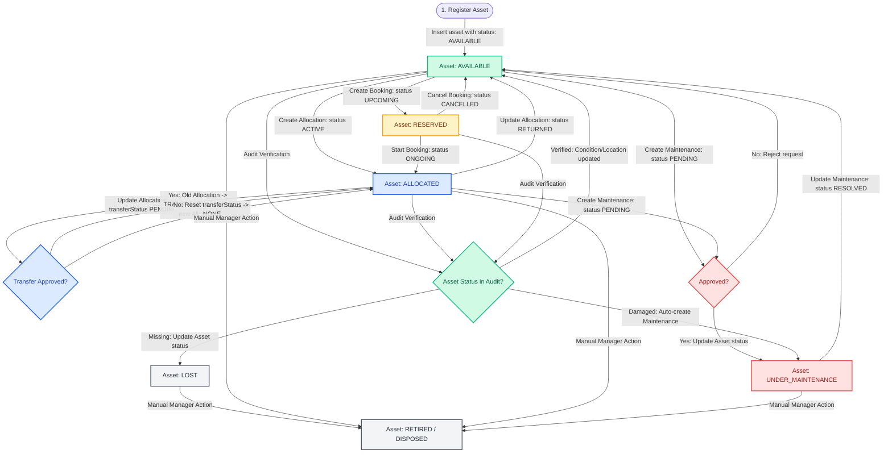

# Database Flow: Asset Lifecycle State Transitions

This document details the database status transitions and triggers that occur throughout an asset's lifetime in the AssetFlow ERP system.

---

## Lifecycle State Machine Diagram
The flowchart below illustrates how actions performed in transactional collections (`allocations`, `bookings`, `maintenances`, `audits`) automatically trigger status updates within the `assets` collection.

---

## Detailed Collection Actions and State Transitions

### Step 1: Register Asset
- **Trigger**: Asset Manager inserts a new document in the `assets` collection.
- **Database Action**:
  - `status` set to `AVAILABLE`.
  - `condition` set to `NEW` or `GOOD`.
  - `history` array appends `REGISTERED` action.
  - `activitylogs` appends a log entry detailing the creation.

### Step 2: Allocation
- **Trigger**: Department Head or Admin allocates an available asset to an employee.
- **Database Action**:
  - Inserts new document in `allocations` collection with `status: "ACTIVE"`.
  - Updates the `assets` document: sets `status` to `ALLOCATED` and appends `ALLOCATED` to its `history` array.
  - Appends to `notifications` collection alerting the employee.

### Step 3: Transfer
- **Trigger**: Current assignee or Department Head requests a transfer to another user.
- **Database Action**:
  - Updates the active `allocations` document: sets `transferStatus` to `PENDING_APPROVAL` and `transferRequestedTo` to the recipient user's ID.
  - *If Approved*:
    - Updates old allocation `status` to `TRANSFERRED`.
    - Inserts a new allocation document with `status: "ACTIVE"`, `employeeId` as the recipient, and `allocatedById` as the approver.
    - Appends `TRANSFERRED` to the asset's `history` array.
  - *If Rejected*:
    - Resets `transferStatus` to `NONE` and `transferRequestedTo` to `null`.

### Step 4: Maintenance Request
- **Trigger**: Employee reports hardware issue, or an Audit reports physical damage.
- **Database Action**:
  - Inserts document in `maintenances` with `status: "PENDING"`.
  - *If Approved*:
    - Updates maintenance `status` to `APPROVED` or `TECHNICIAN_ASSIGNED`.
    - Updates asset `status` to `UNDER_MAINTENANCE` and appends `MAINTENANCE_REQUESTED` to its `history` array.
  - *If Resolved*:
    - Updates maintenance `status` to `RESOLVED` and records `completionDate`, `cost`, and `resolutionDetails`.
    - Updates asset `status` to `AVAILABLE` (if returned) or `ALLOCATED` (if returned straight to assignee).
    - Updates asset `condition` based on technician notes (e.g. `GOOD`).
    - Appends `MAINTENANCE_COMPLETED` to its `history`.

### Step 5: Return Asset
- **Trigger**: Employee returns physical asset to IT inventory.
- **Database Action**:
  - Updates allocation `status` to `RETURNED` and populates `actualReturnDate`.
  - Updates asset `status` to `AVAILABLE`.
  - Appends `RETURNED` to the asset's `history`.

### Step 6: Audit Cycle
- **Trigger**: Asset Manager starts an audit cycle (`audits` collection `status: "ACTIVE"`).
- **Database Action**:
  - Auditor inspects assets and updates the audit lists:
    - *If Verified*: Adds to `verifiedAssets`. If condition or location changed, updates the asset's main record.
    - *If Missing*: Adds to `missingAssets`. Updates asset `status` to `LOST` and appends `LOST_REPORTED` to history.
    - *If Damaged*: Adds to `damagedAssets`. Auto-creates a `PENDING` corrective maintenance record, and sets asset `status` to `UNDER_MAINTENANCE`.
