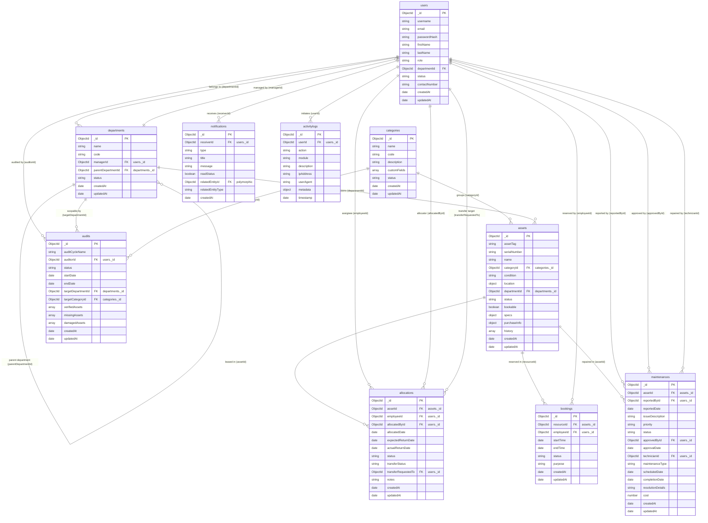

# Database Diagram: Entity Relationship (ER)

This diagram visualizes the MongoDB database architecture for **AssetFlow**. All connections represent MongoDB `ObjectId` reference relations.

### Relationship Legend
- `||--o{` : One-to-Many relationship (e.g. one department can own zero or many assets).
- `||--o|` : One-to-Zero/One relationship (e.g. one department has zero or one manager).
- `FK` : Foreign Key relationship (represented by reference ObjectIds in MongoDB).
