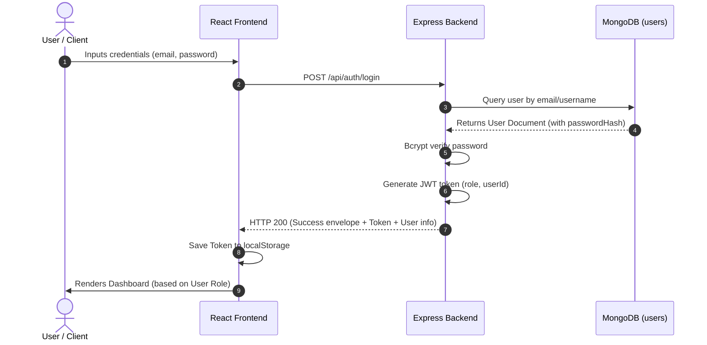
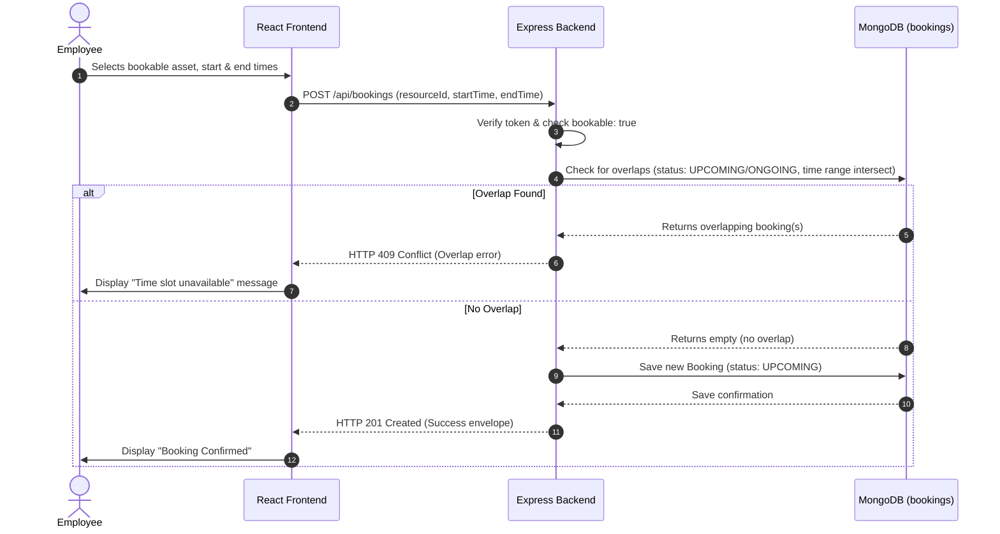
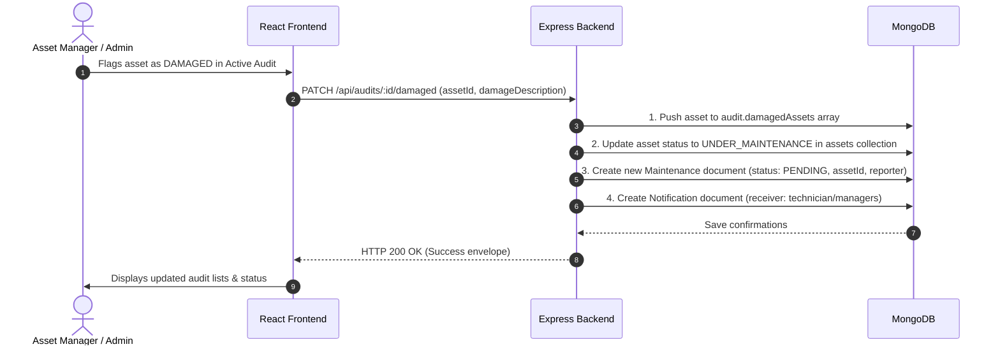

# Architecture: Integration Flow

This document details the communication flow between the React Frontend, Express Backend, and MongoDB Database for critical workflows.

---

## 1. Authentication Flow

This flow illustrates credentials submission, verification, and token attachment for subsequent queries.

---

## 2. Resource Booking Overlap Check

How the system checks and books resources, ensuring that double bookings do not occur.

---

## 3. Audit Damaged Asset Cascade

When an auditor flags an asset as damaged, triggering status locks and maintenance work orders.

