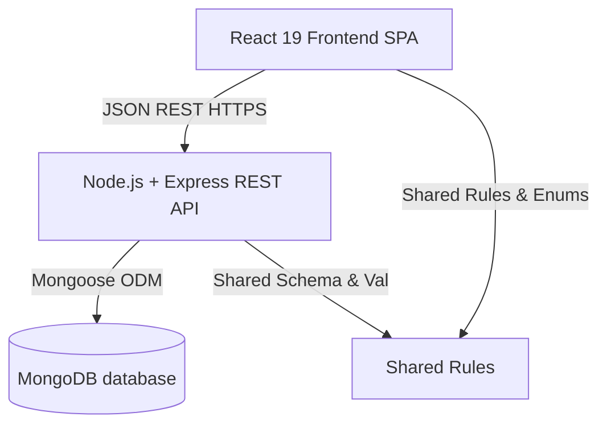
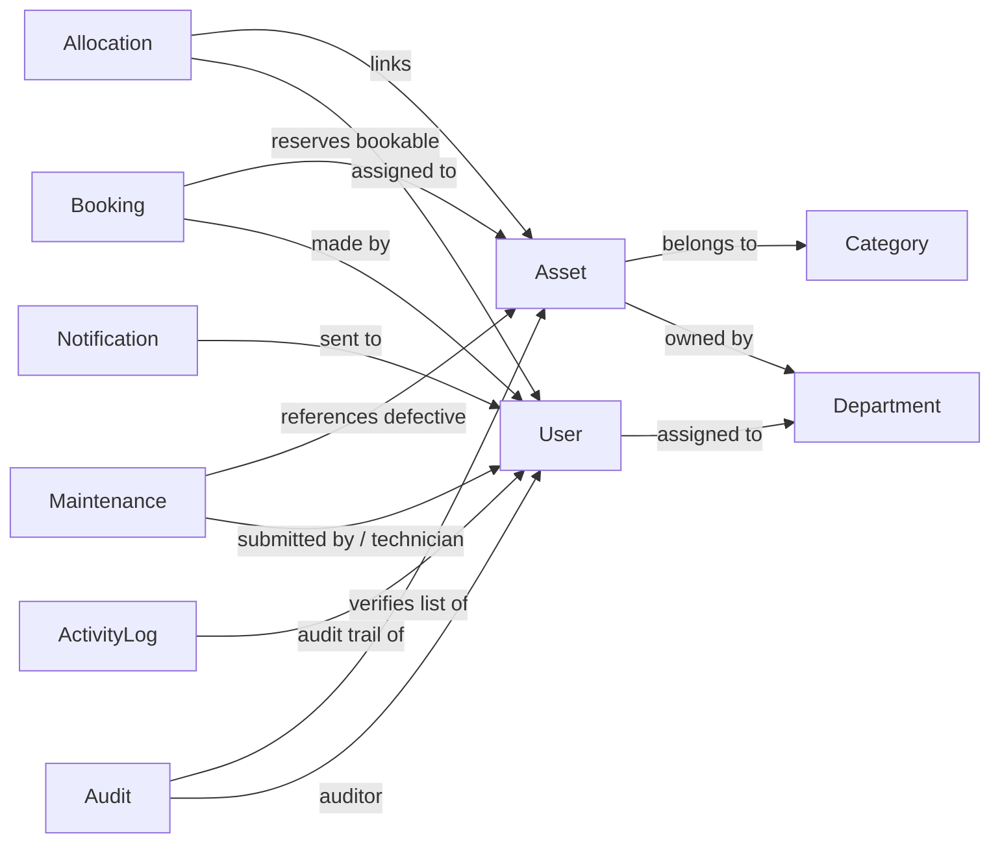

# Architecture: System Overview

AssetFlow ERP is built on a 3-tier monolithic architecture designed for rapid deployment and high reliability during local development and operation.

## Component Overview

1. **Frontend Client**: SPA built with React 19 and Vite. Uses Axios to communicate with the backend, stores JWT token in `localStorage`, and handles conditional page/action rendering using the shared permissions matrix.
2. **Backend Server**: Express.js REST API providing JSON response envelopes. Manages JWT sessions, routes middleware-based role access checks, processes data mutations, and updates database state.
3. **Database Server**: MongoDB document database containing 10 indexed collections. Data relationships are modeled using reference fields (`ObjectId`) and partial indexes to maintain integrity.

---

## Module Interaction

AssetFlow is divided into interconnected domain modules:

- **Core Setup**: Users and Assets map to Departments. Assets also map to Categories (defining specs).
- **Assignments**: Allocations link available Assets to active Employees. Bookings schedule time-slot reservations for bookable Assets.
- **Support & Compliance**: Audits check asset condition and location, automatically spawning Maintenance tickets for damaged items and status locks (`UNDER_MAINTENANCE`).
- **Activity & Messaging**: Database updates trigger automated Notifications for employees and managers, while the Activity Log tracks mutations for compliance.

---

## Key Data Flow Highlights

* **Authentication Lifecycle**: User provides credentials → Express hashes with bcrypt and verifies → JWT token signed and returned → Client sends token in `Authorization: Bearer <token>` header → Middleware checks role permissions.
* **Asset Allocation**: Asset status is verified (`AVAILABLE`) → Allocation saved as `ACTIVE` → Asset status transitions to `ALLOCATED` (locked from other allocations or bookings) → System notifications sent to receiver.
* **Audit & Maintenance Cascade**: Active audit flags item as `DAMAGED` → Asset status updated to `UNDER_MAINTENANCE` → Corrective maintenance request created automatically in `PENDING` state → Asset is locked until maintenance is marked as `RESOLVED`.
