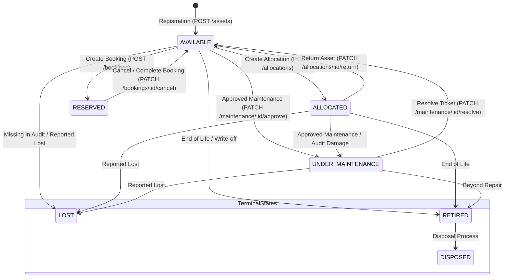

# Workflow: Asset Lifecycle

This document describes the state machine governing physical assets in the AssetFlow ERP system.

## Asset State Machine

---

## State Descriptions & Rules

1. **`AVAILABLE`**: The default state. The asset is in stock and located in its registered location. Eligible for allocations or bookings.
2. **`ALLOCATED`**: Assigned to an active employee via an allocation document. Locked from other allocations and bookings.
3. **`RESERVED`**: Blocked during a confirmed `UPCOMING` booking slot. Locked from allocation during this reservation timeframe.
4. **`UNDER_MAINTENANCE`**: Under repair. Triggered automatically by approved maintenance or when flagged as `DAMAGED` during an audit. Locked from allocation or bookings.
5. **`LOST`**: Administrative terminal state for missing items.
6. **`RETIRED`**: Out-of-service terminal state.
7. **`DISPOSED`**: Final terminal state indicating the asset was scrapped, sold, or recycled.
