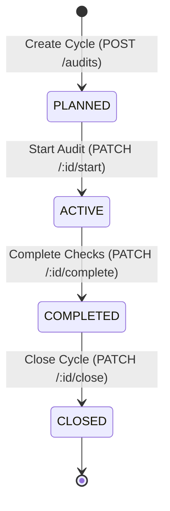
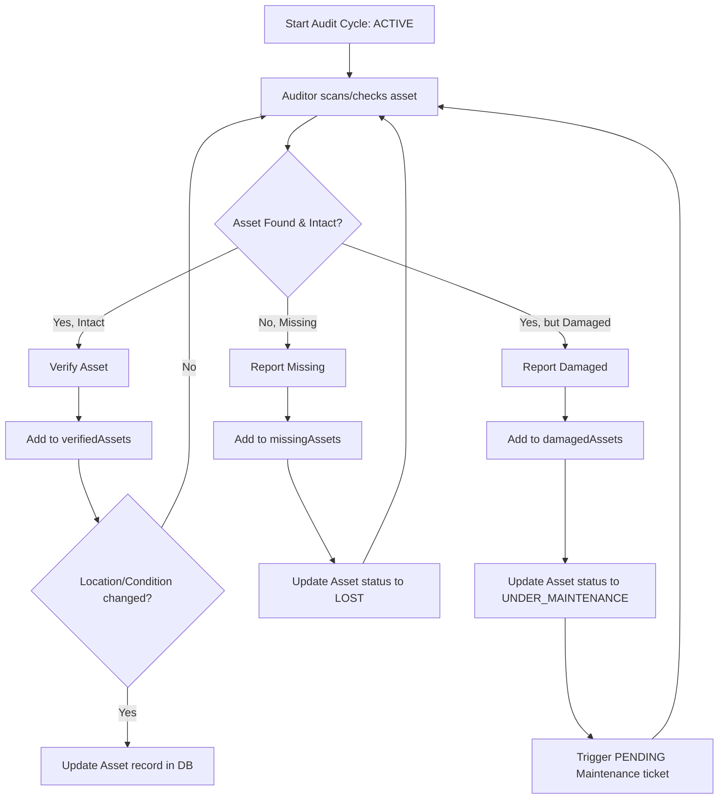

# Workflow: Audit Workflow

Governs organizational inventory checking and physical asset verification cycles.

## Audit Cycle States

---

## Audit Verification Steps

---

## Detailed Rules

1. **Verification Cascade**: When verifying an asset, if the scanned location or condition differs from the current record in the database, the backend automatically updates the `assets` collection.
2. **Missing Cascade**: Flagging an asset as missing sets its status to `LOST`.
3. **Damaged Cascade**: Flagging an asset as damaged changes its status to `UNDER_MAINTENANCE` and automatically inserts a new `PENDING` maintenance work order request.
4. **Closure Lock**: Transitioning an audit cycle to `CLOSED` writes an `endDate` timestamp and locks the verified, missing, and damaged arrays from any further modifications to ensure data integrity.
