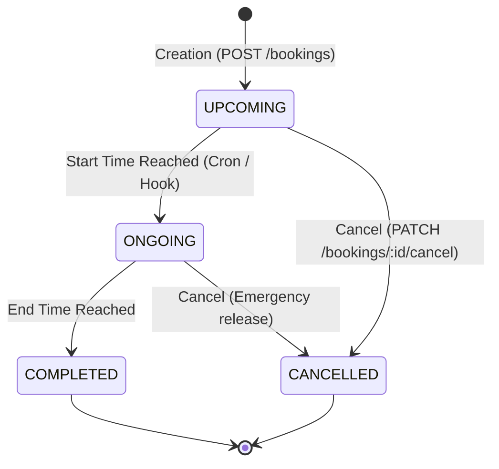
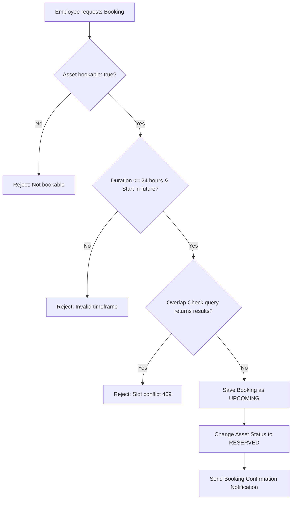

# Workflow: Booking Workflow

Manages short-term reservations for shared resources (e.g. conference rooms, projectors, test benches).

## Booking State Transition

---

## Step-by-Step Flow

---

## Detailed Rules

1. **Overlap Definition**: A conflict is detected if there is an existing booking for the same resource with status `UPCOMING` or `ONGOING` that overlaps with the requested range `[newStart, newEnd]`. The backend verifies this using:
   $$\text{existingStart} < \text{newEnd} \quad \text{AND} \quad \text{existingEnd} > \text{newStart}$$
2. **Asset Locking**: When the asset is `RESERVED` for a booking, it cannot be allocated to any user or booked by another slot.
3. **Cancellation**: When cancelled, the reservation is released immediately, setting asset status to `AVAILABLE` so it is immediately bookable by others.
