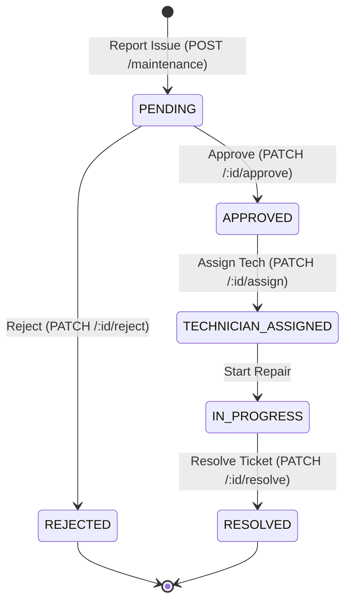
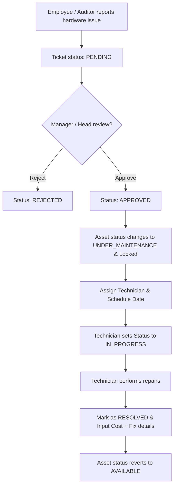

# Workflow: Maintenance Workflow

Tracks the reporting, approval, and execution of hardware repairs.

## Maintenance Lifecycle

---

## Workflow Steps

---

## Detailed Rules

1. **Asset status lock**: Once the ticket is `APPROVED` or in `IN_PROGRESS`, the asset is locked (status `UNDER_MAINTENANCE`). No other employee can allocate it or create a booking for it.
2. **Resolution requirement**: Marking a ticket as `RESOLVED` requires providing a description of `resolutionDetails` and a valid decimal `cost` value (even if `0`). On saving, the asset status changes back to `AVAILABLE`.
3. **Approval gate**: Technicians cannot be assigned and repair work cannot begin until the ticket has been formally `APPROVED` by a Manager or Admin.
