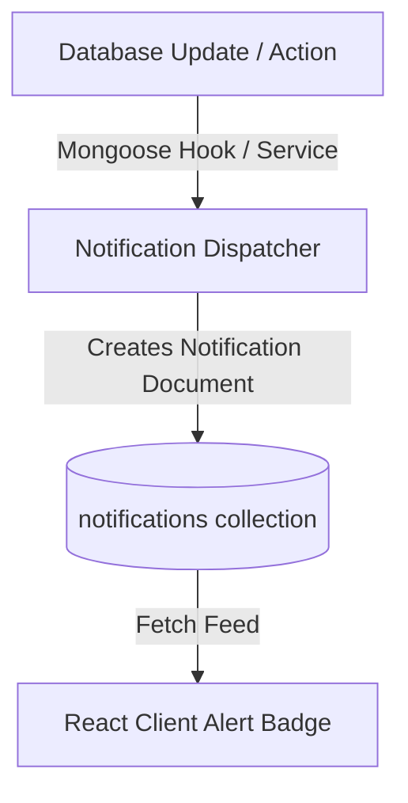

# Workflow: Notification Flow

Describes the automated trigger-and-dispatch flow of notifications when state changes occur.

## Notification Trigger Architecture

---

## Automatic Trigger Points

The backend automatically creates notification logs under the following conditions:

| Trigger Event | Target Receiver | Notification Type | Message Summary |
| :--- | :--- | :--- | :--- |
| **New Allocation Registered** | Assigned Employee | `ALLOCATION` | Details of the allocated asset and expected return date. |
| **Transfer Request Initiated** | Department Manager / Admin | `TRANSFER_REQUEST` | Details of current allocation holder, target receiver, and request notes. |
| **Transfer Approved/Rejected** | Current Holder & Receiver | `ALLOCATION` | Notification of success or cancellation of request. |
| **Maintenance Approved / Assign**| Assigned Technician | `MAINTENANCE_ALERT` | Assignment details and scheduled date. |
| **Maintenance Resolved** | Ticket Reporter | `MAINTENANCE_ALERT` | Confirmation that repair is complete. |
| **Booking Confirmed / Cancelled**| Booker (Employee) | `BOOKING_CONFIRMATION`| Asset, reservation timeslot, and purpose. |

---

## Notification State & Read Loop

1. **Generation**: The backend writes the notification with `readStatus: false`.
2. **Display**: The frontend requests `/api/notifications`, showing a badge count of unread items.
3. **Read Toggling**: The user clicks the notification, triggering `PATCH /api/notifications/:id/read` which sets `readStatus: true`. The user can also trigger `PATCH /api/notifications/read-all`.
4. **Immutability**: All fields of a notification (title, message, receiver, entity links) are immutable once created. Only `readStatus` can be mutated by the receiver.
